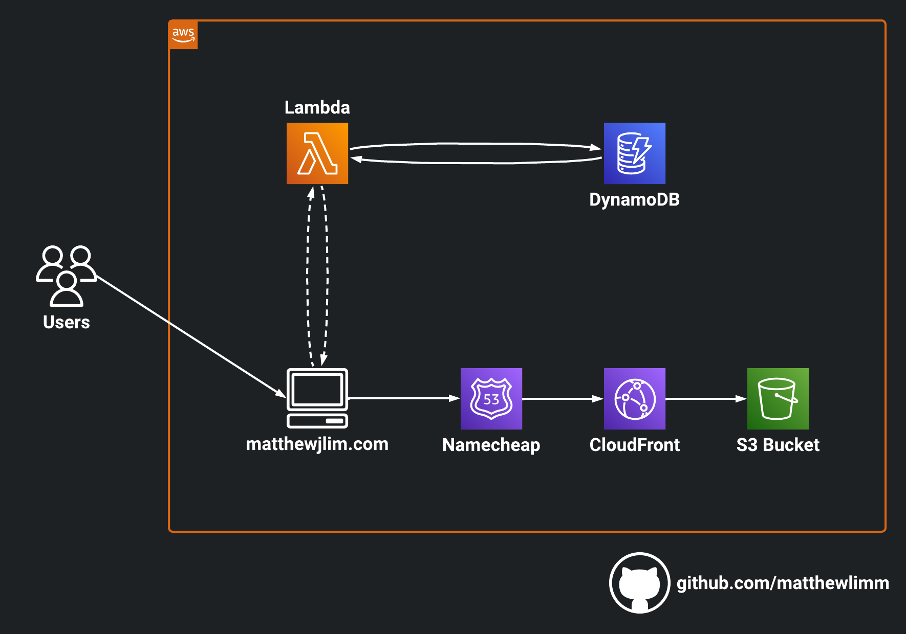

# matthewjlim.com — AWS Cloud Resume Challenge

This project represents my implementation of the Cloud Resume Challenge, a comprehensive AWS-based portfolio initiative. [The Cloud Resume Challenge](https://cloudresumechallenge.dev/), made by Forrest Brazeal, is a multi-faceted technical exercise designed to validate and showcase proficiency in core cloud computing competencies essential for cloud engineering roles. This hands-on project encompasses infrastructure as code, serverless architecture, CI/CD pipelines, and modern web development practices, serving as a practical demonstration of end-to-end cloud solution design and deployment capabilities.

## Architecture

**Services Used**:

- S3
- AWS CloudFront
- Certificate Manager
- AWS Lambda
- Dynamo DB
- GitHub Actions
- Terraform
